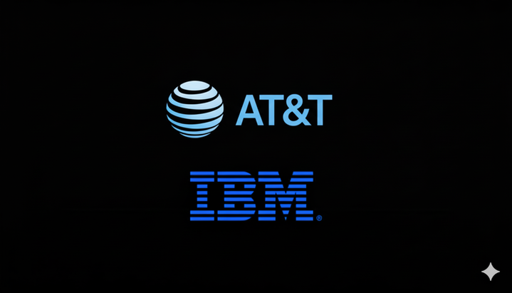

# Supervisor Assistant  

This use case is about an AI-powered assistant supporting a Network Supervisor in managing service disruptions. The Supervisor is responsible for monitoring the health of regional networks, diagnosing incidents, coordinating across infrastructure and communications, and ensuring timely remediation to minimize downtime. We apply an agentic solution based on watsonx Orchestrate and watsonx.ai to optimize these processes.  

---

## The Problem  
A large telecommunications provider faces frequent challenges in its Network Operations Center (NOC). Supervisors often deal with fragmented monitoring tools, siloed logs, and manual processes when diagnosing and resolving service disruptions. This results in long mean-time-to-resolution (MTTR), delayed communications to field teams, and occasional gaps in incident handovers. The manual coordination between teams further slows down operations, leading to increased costs and customer dissatisfaction.  

---

## Objective  
The objective is to design and implement an **Agentic AI-enabled incident management system** that leverages orchestration of specialized agents. The solution will allow a Supervisor to:  

- Query server and network status in real time  
- Diagnose the root cause of network incidents using logs and resolution guides  
- Coordinate communications with internal field teams  
- Identify remediation flows when required  

The assistant will serve as a **single conversational interface** (text or voice) for the Supervisor, reducing tool-switching and empowering faster decision-making.  

---

## Business Value  
The Supervisor Assistant transforms incident response by:  

- **Reducing MTTR**: Automating diagnosis and cross-checking across network and server data speeds up investigations.  
- **Improving communication**: Drafting clear, structured updates for regional field teams ensures consistent information sharing.  
- **Enhancing reliability**: Reducing human error by providing AI-driven root cause analysis and guided remediation steps.  
- **Scaling expertise**: Less experienced supervisors can rely on the assistant's recommendations, reducing dependence on manual tribal knowledge.  

Overall, this results in **lower operational costs, reduced downtime penalties, and higher customer satisfaction**.  

---

## Architecture  

The system integrates multiple specialized agents coordinated by the Supervisor Agent:  

- **Network Status Agent** → Queries network data sources for regional and site-level status.  
- **Server Status Agent** → Uses server diagnostic tools to check availability and performance.  
- **Incident Diagnosis Agent** → Runs log analysis, identifies likely root causes, and retrieves remediation steps.  
- **Communications Agent** → Drafts structured internal updates for field teams.  

Orchestration is handled in **watsonx Orchestrate**, with specialized tools and knowledge sources connected via YAML and Python interfaces.  

---

## Step-by-step Hands-on Instructions  
Step-by-step instructions for running this use case are available in [this document](./Supervisor_Instructions_v2.md).  

---

## Storyline Walkthrough  

The **Supervisor** receives an alert of a service disruption at a regional site. They engage the **Supervisor Agent** via the Orchestrate conversational interface.  

1. **Check server status** → "Check the server status of `ATT.com`."  
2. **Assess incidents** → "Are there any incidents in our network?"  
3. **Retrieve site data** → "Get me the network status for site `S002`."  
4. **Diagnose root cause** → "What is the root cause of this error and what are the steps to resolve it?" (with source references).  
5. **Communicate resolution** → "Draft an email for the Los Angeles AT&T Network team with everything we discussed and let them know the issue is resolved."  

This demonstrates how multiple agents coordinate seamlessly under the **Supervisor Agent's orchestration**, closing the loop from detection to communication.  

---
