## Table of Contents

  - [Introduction](#introduction)  
    - [Pre-requisites](#pre-requisites)
    - [Watsonx Orchestrate Setup](#watsonx-orchestrate-setup)  
    - [Local Dev Environment Setup](#local-dev-environment-setup)  
  - [Lab 1: Create Your First Agent](#lab-1:-create-your-first-agent) <!--Tag not working?-->
    <!-- - [AI Agent Configuration](#ai-agent-configuration)   -->
    - [The Network Status Agent](#the-network-status-agent)
    - [The Communication Agent](#the-communication-agent)
  - [Part 2: Agent Development Kit](#lab-2:-agent-development-kit)    
    - [The Incident Diagnosis Agent](#the-incident-diagnosis-agent) 
    - [The Server Status Agent](#the-server-status-agent)
    - [The Supervisor Agent](#the-supervisor-agent)  
  - [Summary](#summary) 

## Introduction  

This use case describes a scenario where a Network Supervisor leverages an AI assistant through a natural language chat interface to investigate, diagnose, and resolve service disruptions. The assistant acts as a central routing point that selects the appropriate specialized agent to satisfy each request, ensuring rapid coordination across tools and knowledge sources.  

Agents can be configured in the system to address specific needs of the supervisor. Each agent is powered by a Large Language Model (LLM) with function-calling capabilities, enabling it to invoke the right tools or knowledge bases based on the task description.  

In our scenario, we will build agents for **Network Status**, **Server Status**, **Incident Diagnosis**, and **Communications**, all coordinated by a **Supervisor Agent**. This setup allows the Supervisor to ask questions in plain language, such as checking server health, investigating site-specific outages, diagnosing root causes, and drafting updates for field teams.  

There is an argument to be made that a truly agentic solution would demonstrate a high degree of autonomy. In such a setup, the system itself could monitor alerts, analyze logs, determine the root cause, generate a remediation plan, and notify stakeholders — all without human intervention. However, we can also maintain a **“human in the loop”** approach, where the Supervisor drives the workflow step by step, verifying outputs from each agent before proceeding to the next stage. This flexibility allows organizations to balance automation with oversight.  

<div style="border: 2px solid black; padding: 10px;">
Even though we will take you through a complete and working example, you should also consider making changes that fit your desired use case, and only take this description as a reference point that guides you along your own implementation.
</div>  

-----

### Pre-requisites  

Before starting the lab, please ensure you have the following installed and configured on your system:  
1.  **IBM Cloud Account**  
    - Use your Dish email to create an IBMid: https://www.ibm.com/account/reg/us-en/signup?formid=urx-19776&a=@OIDC_CLIENT_ID@&Target=https%3A//www.ibm.com/internet-of-things/
    - Check your email for a confirmation code and activate your IBMid
    - You now have an IBMid. If done correctly you will receive an email stating your IBMid is activated. You can close this webpage.

2. **Python 3.11+**  
   - Download from [python.org](https://www.python.org/downloads/release/python-3110/).  
   - Verify installation:  
     ```bash
     python3 --version
     ```   

3. **IDE (Visual Studio Code)**  
   - Download from [code.visualstudio.com](https://code.visualstudio.com/).  
   - Install recommended extensions:  
     - *Python* (for coding and debugging).  
     - *YAML* (for agent and tool configuration files).

4. **Git (Optional)**  
   - Download from [git-scm.com](https://git-scm.com/downloads).  
   - Verify installation:  
     ```bash
     git --version
     ``` 
  


Once these prerequisites are installed, you will be ready to set up the dev environment and begin the lab in Watsonx Orchestrate.  

- Check with your instructor to ensure **all systems** are up and running before you continue.  
<!-- - If you're an instructor running this lab, check the **Instructor's guides** to set up all environments and systems.   -->

### Watsonx Orchestrate Setup

Watsonx Orchestrate is IBM’s platform for creating, managing, and running AI-driven digital workers and agentic flows. In this bootcamp, you will be provided an IBM Cloud SaaS instance of Orchestrate. Follow the steps below to gain access to your Orchestrate Instance: 

1. **Environment Assignment** 
   - Ensure you've created an IBM Cloud account.
   - If you're assigned to a group follow the instructions on the table to assign yourself to a group. https://wkf.ms/41ugV3u
    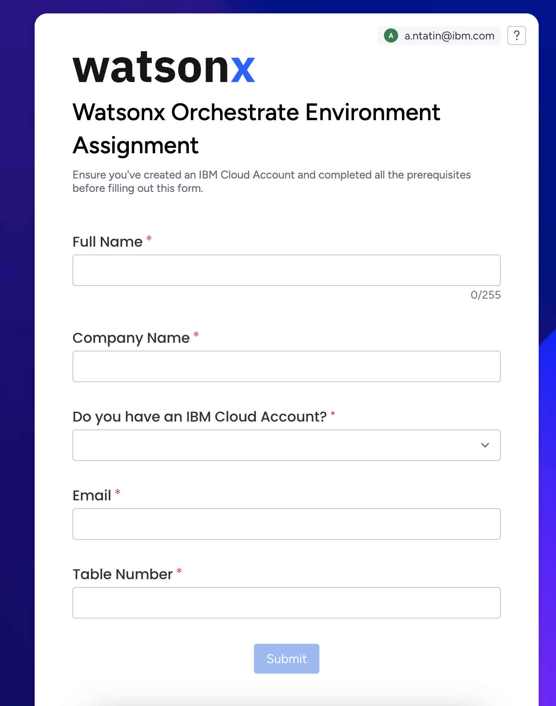
2. **Join IBM Cloud Account** 
   - You should recive an email with a link to join an IBM Cloud account
   - Accept the invite and sign in to your IBM Cloud Account
3. **Access your Orchestrate Instance**
   - In the IBM Cloud Dashboard navigate to the Resource List. Under AI/ML select watsonx Orchestrate-Temp-Workshop and launch the application.
  
  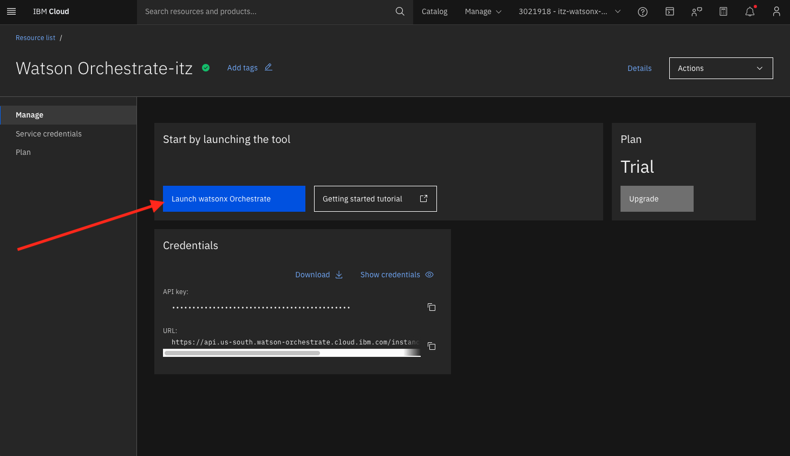
   - If you don't see any resources under AI/ML in your IBM Cloud Account kindly reachout to an instructor for assistance. 
   - Once you have access to an Orchestrate instance you may continue to the next section

---
#### Local Dev Environment Setup

- Run the following command below to clone the repository. This will give you the foundational resources to complete the bootcamp.

```bash
  git clone https://github.com/priyanalliah/ai-agentic-bootcamp-dish.git
```  

- Now open the project folder in vscode, and navigate to the terminal within the project directory.
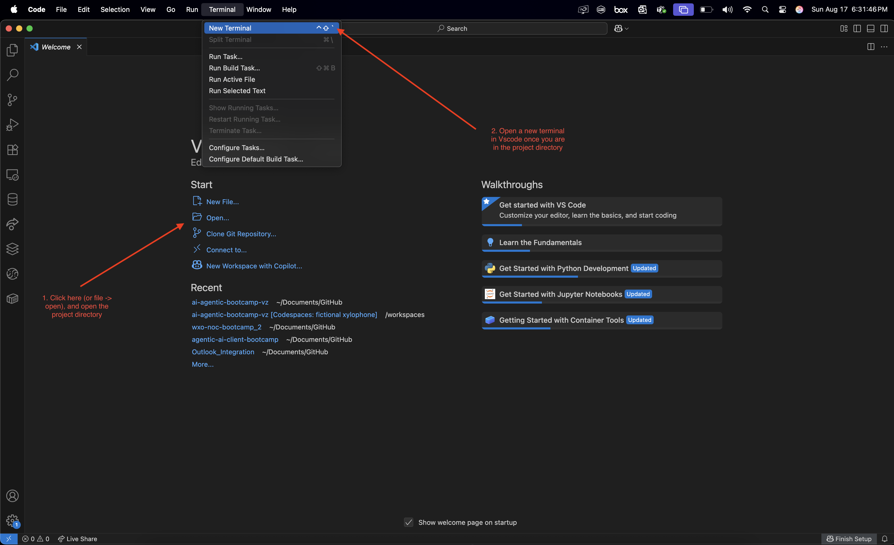

- [Installing the ADK](https://developer.watson-orchestrate.ibm.com/getting_started/installing#setting-up-and-installing-the-adk): Once you the terminal appears on your screen, ensure you are in the folder where the contents of the repo live. Now type in the following commnads line by line. Ensure you see (bootcamp_venv) in the terminal line before running pip install
  - MacOS :
     
    ```
        python3.11 -m venv bootcamp_venv
        source bootcamp_venv/bin/activate
        pip install ibm-watsonx-orchestrate
    ```
  - Windows:
    ```
        python -m venv bootcamp_venv
        bootcamp_venv/Scripts/activate
        pip install ibm-watsonx-orchestrate
    ```   

Here, we are creating a virtual environment for our dependencies to live. This allows our agents to work in an isolated workspace with out the interference of other global Python libraries on your device. After, we install the SaaS version of Watsonx Orchestrate so we can import our future agents and tools through the CLI.

<!-- - Now we will rename our `.env_example` to `.env` through vscode. To do so, click on the pages icon on the left side and find the `.env_example` file. Right click on the file and rename it to `.env`. This will be a place where we store our credentials so that we can connect to Watsonx Orchestrate. -->

#### Orchestrate Instance Details
- Navigate to the IBM Cloud resource list. And launch Orchestrate.
      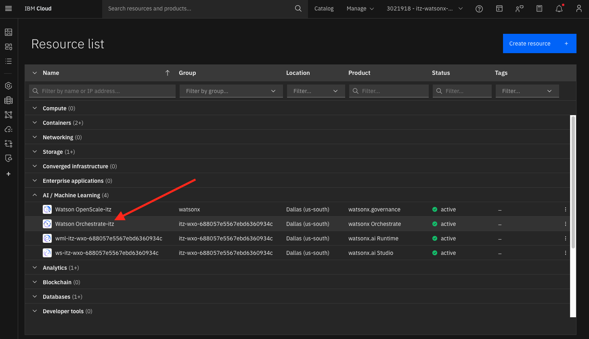
  
- Navigate to the Orchestrate Settings > API details. And Save the URL as we will use it in a later step.
    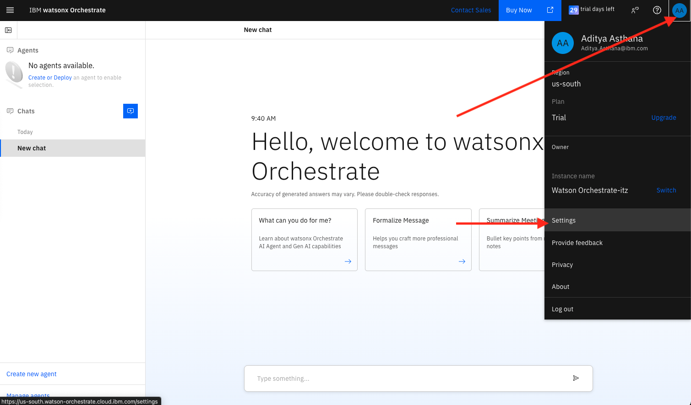
    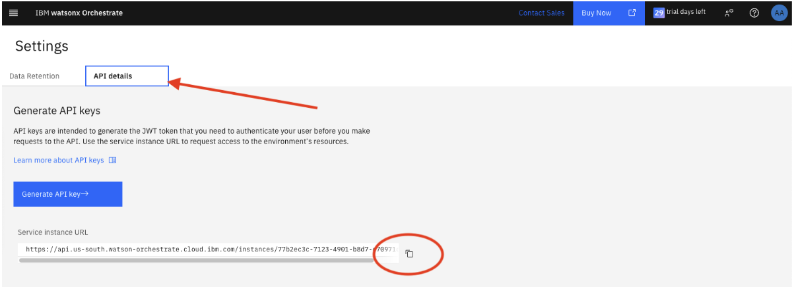
- Click on the Generate API Key button. It should redirect you to the IBM Cloud IAM API Key page.
      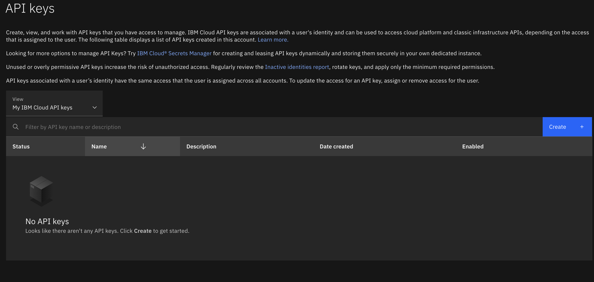
- Click Create and provide a name. Leave all other settings default
  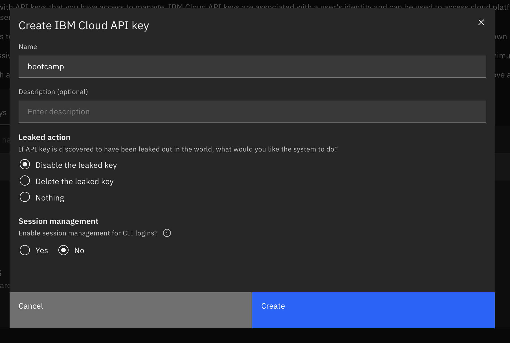
- Once complete you should recieve an API Key. Save this key.
  
    

#### ADK Setup
1. [Creating an environment](https://developer.watson-orchestrate.ibm.com/environment/initiate_environment#creating-an-environment): Go to vscode and open the terminal. Make sure you are in the directory inside the cloned repo. The use the command: `orchestrate env add -n <environment-name> -u <service-instance-url> --type ibm_iam --activate`. Replace the environment-name with a name of your choice, and the service-instance-url with the url from your env file. 

2. [Activating an environment](https://developer.watson-orchestrate.ibm.com/environment/initiate_environment#activating-an-environment): Now run `orchestrate env activate <environment-name>` and replace environment-name with the name you chose from before.

---
## Lab1: Create Your First Agent  

In this lab, we will configure a set of 4 agents and 1 supervisor agent inside **Watsonx Orchestrate**. Each agent has a distinct responisbility and a unique toolset to comeplete a specific role in the incident response agentic system. The **Supervisor Agent** coordinates work among the agents by orchestrating requests to the appropriate agent. Below you will find an outline of all the agents we will build during this lab.

##### Network Status Agent:  
- **Purpose**: Answers queries about the operational status of the network — including regions, sites, nodes, and active incidents.  
- **Tooling**: This agent connects to a **get_data tool** provided through an OpenAPI JSON file, enabling retrieval of up-to-date network data.  
- **Usage**: Handles queries like “What is the status of site S002?” or “Are there any ongoing outages in the Northeast region?”  

##### Communications Agent  
- **Purpose**: Drafts professional and concise email updates for internal or external stakeholders about incidents or operational changes.  
- **Tooling**: This agent integrates with **Outlook** using an imported **OpenAPI JSON tool**, which enables it to send notification emails automatically.  
- **Usage**: When the Supervisor requests an incident update for the “Los Angeles dish Network team,” this agent generates the email body and sends it through Outlook. 

##### Incident Diagnosis Agent  
- **Purpose**: Analyzes incident logs, identifies the most likely **root cause**, and recommends a **resolution plan**.  
- **Tools**: Connects to a log analysis tool.  
- **Knowledge Sources**: Uses an incident resolution knowledge base for remediation steps.  
- **Output**: Always provides both the error type and the recommended resolution plan.  

##### Server Status Agent  
- **Purpose**: Verifies whether a specific server or URL is currently online and reachable.  
- **Tools**: Uses a server check tool to confirm availability.  
- **Usage**: Handles requests like “Check if dish.com is up.”  
 

##### Supervisor Agent  
- **Purpose**: Acts as the **routing agent**, interpreting user queries and delegating tasks to the right specialized agent.  
- **Collaborators**:  
  - **Network Status Agent** → for network/site health checks.  
  - **Server Status Agent** → for server reachability.  
  - **Incident Diagnosis Agent** → for log analysis and remediation.  
  - **Communications Agent** → for drafting and sending updates.  
- **User Experience**: Provides a natural language interface for the Supervisor, serving as the single entry point for all incident-related queries.  

Together, these agents form the backbone of the **Supervisor Assistant**. The Supervisor Agent orchestrates their interactions so that complex workflows (incident detection → diagnosis → remediation → communication) can be completed in a seamless conversational flow. Lets get started!

<!-- ### Importing agents using the watsonx Orchestrate Console
**Accessing the console**: Navigate to the Watsonx Orchestrate home page. In the left-hand navigation menu, click on build to expand the menu and click on “Agent Builder”.
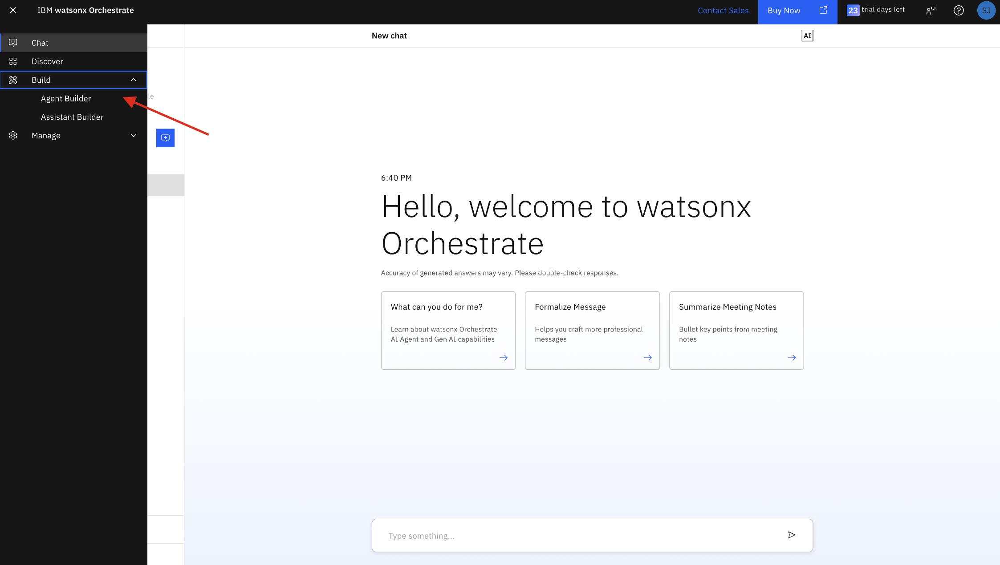

Agents depend on tools to perform their functions. When you define an agent, you specify which tools it can use in the tools section. The system needs the tools to exist before it can validate and import an agent that references them. -->

### The Network Status Agent

<!-- The **Network Status Agent** answers questions about network health (regions, sites, nodes, active incidents).  
In this lab, it **does not use a knowledge base**. Instead, it calls a `get_data` tool defined via an **OpenAPI JSON** so responses are fetched live from the source. -->

**Step 1.** Import the OpenAPI tool (`get_data`)
   - We will first import an external REST API as a tool. To do this we will import an OpenAPI Spec into WXO
     1. Navigate to the Agent Builder tab.
   
     2. Create tool → Add from file or MCP server"→ Upload the OpenAPI (wxo_assets/tools/get_data_openapi.json) → Select the "Get Data" operation → Done**
      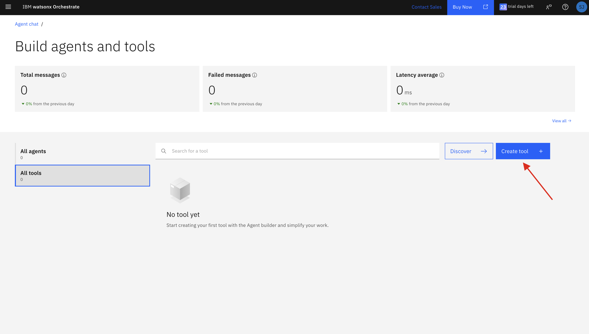
      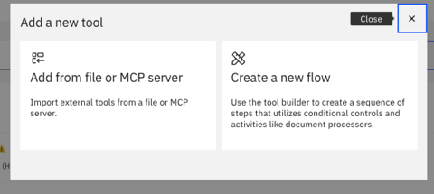
      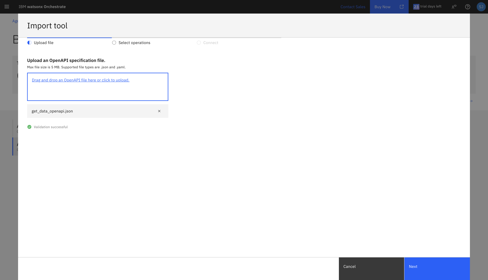
      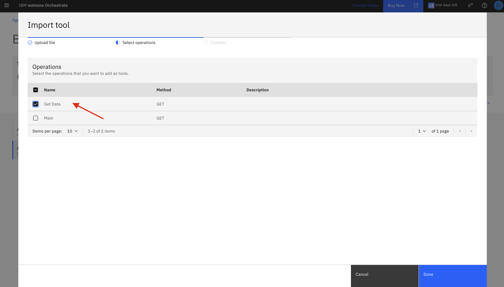
     3. Verify you see an entry for `get_data` tool under the tools homepage.
     4. If you're using a shared environment change the name of your tool not to overwrite other users work. 
      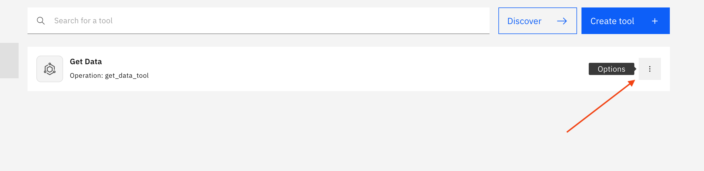
   
  #
  #


> **WXO ADK CLI option:** You can import the OpenAPI tool from the ADK CLI by running the following commands in your terminal.
> - Run: `orchestrate tools import -k openapi -f wxo_assets/tools/get_data_openapi.json`
> - Verify: `orchestrate tools list` → you should see an entry for `get_data`

**Step 2.** Create Network Status Agent
   - Now we will create our first agent. We will add the tool above into it's toolset and test the results.
     1. Navigate to the Agent Builder tab.
     2. To create a new agent click on **All agents → Create Agent → Enter name and description for your agent → Create**

        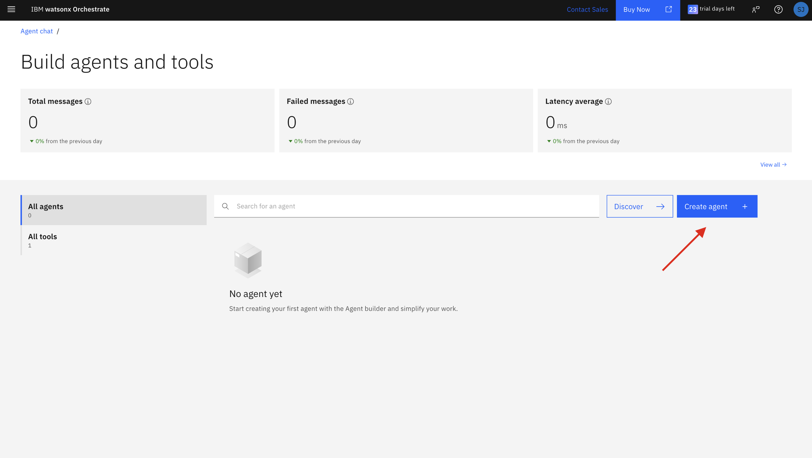
        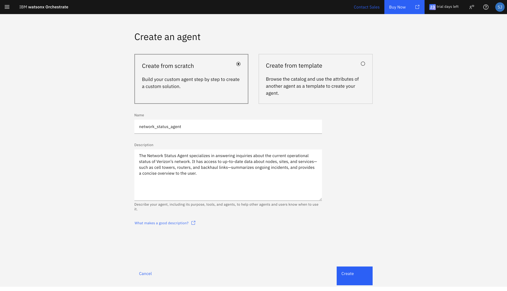
     3. Navigate to the Agent Builder tab.
     3. Give your agent a name. `network_status_agent_(with initials)` 
        - If you're in a shared WXO instance remember to make your name is unique.  
     4. Add a description for your agent. 
         - [Writing Descriptions](https://developer.watson-orchestrate.ibm.com/getting_started/guidelines#writing-descriptions-for-agents): It is necessary to provide well-crafted descriptions for your agents. These descriptions are used by supervisor agents to determine how to route user requests. It helps the agent decide when to consume this agent as a collaborator when it is added to the agent’s collaborator list. 
         - `The Network Status Agent specializes in answering inquiries about the current operational status of dish’s network. It has access to up-to-date data about nodes sites, and services—such as cell towers, routers, and backhaul links—summarizes ongoing incidents, and provides a concise overview to the user.`
      5. Click Create

   - Take some time to fully Explore the Agent screen
        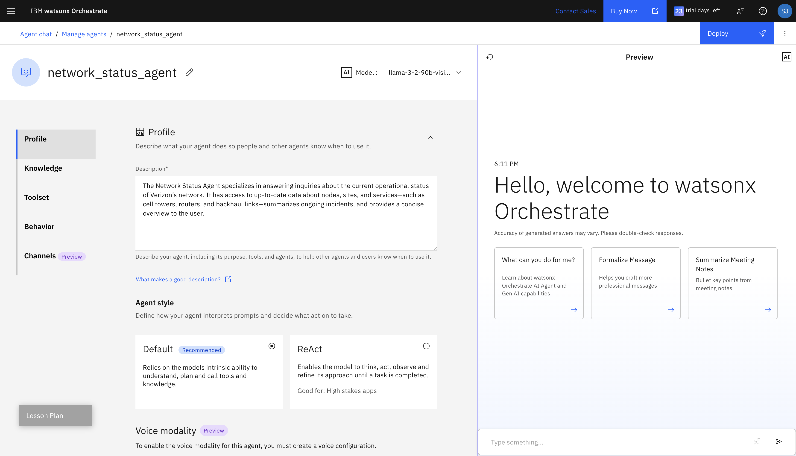

   - Now that we've explored what the platform provides for our Agent lets add our tool.
     1. Scroll down to the **Toolset** section and click on "Add Tool". 
     2. Since we have already added the `get_data` tool to our local instance, we can select and add it to the agent.
      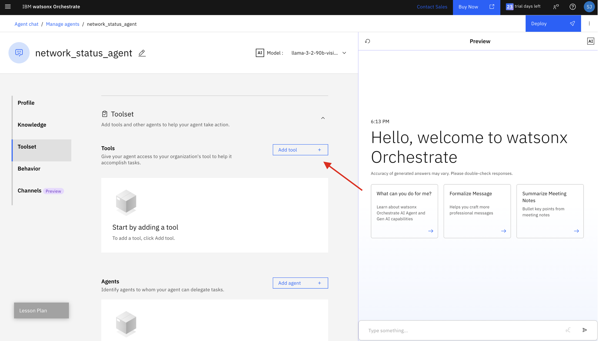
      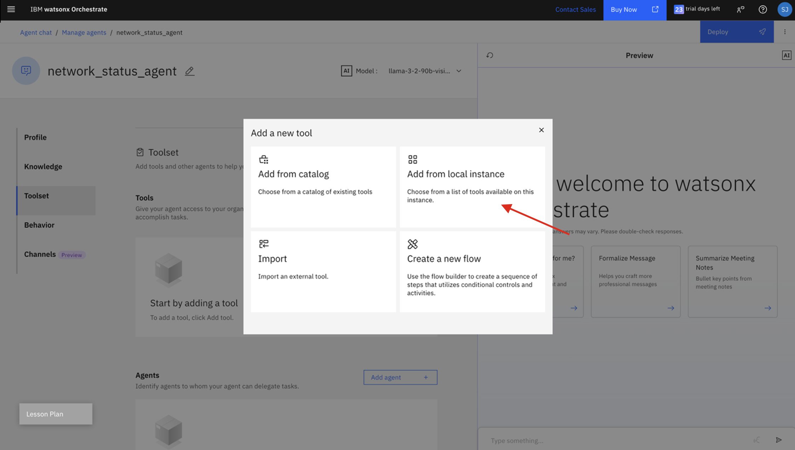
      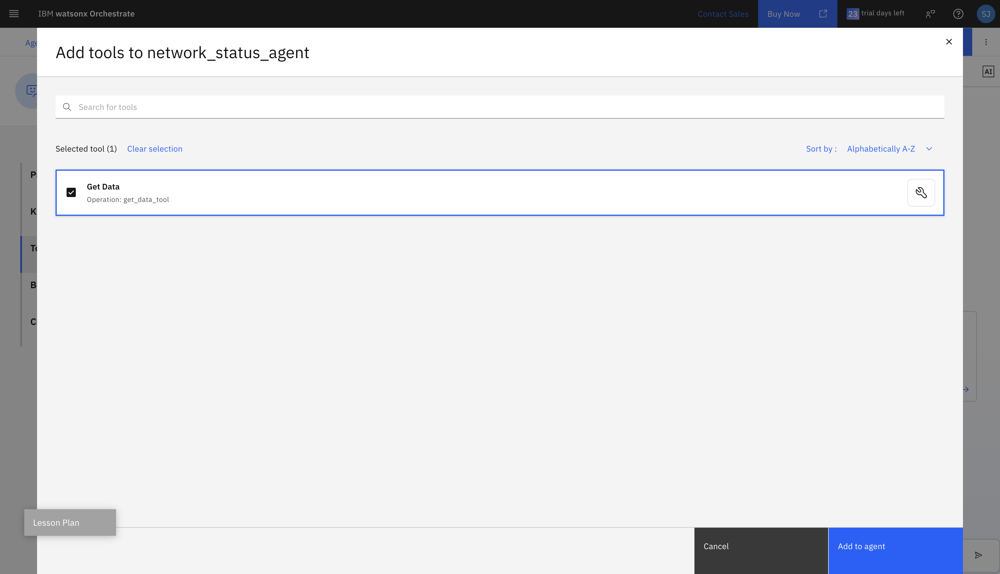
   - Lastly we must add instructions for our agent. This will explain to the LLM what to do, and how to utilize its tools to acomplish the goal.
     1. Scroll down to the **Behavior** section and add the following instructions.
      ```
      - Answer questions about the operational status of dish’s network based on the provided site and node data.This includes information about nodes, incidents, and overall health of regions or specific locations. 
      - Provide your answer as a concise summary. If a location, site ID, or region is mentioned, filter your response accordingly.
      ```
     2. [Writing Behaviours](https://developer.watson-orchestrate.ibm.com/getting_started/guidelines#writing-instructions-for-agents): Next, we scroll down to the **Behavior** section. It is crucial to provide instructions to let agents perform effectively. It decides the behavior of the agent and provides context for how to use its tools and agents.


      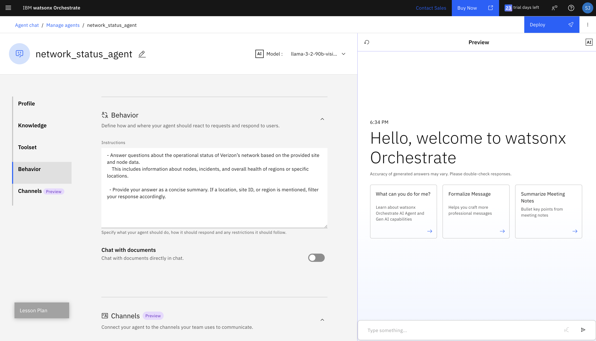
> **WXO ADK CLI option:** You can import the agent from the ADK CLI by running the following commands in your terminal.
>- Run: `orchestrate agents import -f wxo_assets/agents/network_status_agent.yaml`
>- Verify: `orchestrate agents list` → you should see `network_status_agent`


**Step 3.** Now its time to test our agent

   - In the chat ask `What is the status of site S003?`
   - Click on the resoning tab and explore what it did to retrive the answer.
   - `Can you provide me a table of all the cell towers in the system with their relevant status?`
   - `Why is site S004 down?`

#####  Quick sanity check:
- Ask a scoped question (e.g., “What’s the status of site S002?”). The agent should call `get_data` behind the scenes.
- If responses look generic, confirm the tool name in the YAML matches the imported tool’s name exactly (`get_data`), and that the OpenAPI paths/servers are reachable.


#####  Common troubleshooting tips:
- **Tool not found:** Re-run `orchestrate tools list`. If missing, re-import `wxo_assets/tools/get_data_openapi.json`.
- **Name mismatch:** Ensure the tool name referenced in the agent YAML is exactly `get_data`.
- **Auth / endpoint issues:** If your OpenAPI requires auth or a specific base URL, verify those are set correctly in the OpenAPI JSON and accessible from Orchestrate (SaaS).


Congradulations you've just completed building your frist Agent. The **Network Status Agent** is ready. It will now route natural-language queries to the `get_data` tool to return live network status.

---

### The Communication Agent

The **Communications Agent** is responsible for drafting clear and professional notification emails about network incidents or operational updates.  
It integrates with **Outlook** using an OpenAPI JSON tool, allowing it not only to generate content but also to send emails automatically.

#### 1) Import the Outlook Email Tool
This tool provides the functionality for the agent to send emails via the Outlook Mail Server API.
   - We will first import the Outlook REST API as a tool. To do this we will import an OpenAPI Spec into WXO
     1. Navigate to the Agent Builder tab.
        
     2. Create tool → Add from file or MCP server"→ Upload the OpenAPI (wxo_assets/tools/get_data_openapi.json) → Select the "Send Email Outlook" operation → Done**
      
      
      
      3. If you're using a shared environment change the name of your tool not to overwrite other users work. 
      

  -  Explore the Tool Info Screen. 
    1.  Add tool descriptions
    2.  Add descriptions for output schema
    3.  [Writing Tool Descriptions](https://developer.watson-orchestrate.ibm.com/getting_started/guidelines#writing-descriptions-for-tools): Allows agents to identify when to use specific tools.

#
#
#

> **WXO ADK CLI option:** You can import the tool from the ADK CLI by running the following commands in your terminal.
>- Run: `orchestrate tools import -k openapi -f wxo_assets/tools/outlook_email_openapi.json`  
>- Verify: `orchestrate tools list` → you should see `outlook_email`


#### 2) Create the Communications Agent
This agent definition links the Communications Agent with the `outlook_email` tool so it can both draft and send notifications.
   - Now we will create the Communications Agent. We will add the tool above into it's toolset and test the results.
     1. Navigate to the Agent Builder tab.
     2. To create a new agent click on **All agents → Create Agent → Enter name and description for your agent → Create**

        
        

     3. Give your agent a name. `communications_agent_(with initials)` 
        - If you're in a shared WXO instance remember to make your name is unique.  
     4. Add a description for your agent. 
         - [Writing Descriptions](https://developer.watson-orchestrate.ibm.com/getting_started/guidelines#writing-descriptions-for-agents): It is necessary to provide well-crafted descriptions for your agents. These descriptions are used by supervisor agents to determine how to route user requests. It helps the agent decide when to consume this agent as a collaborator when it is added to the agent’s collaborator list. 
         - `The Communications Agent specializes in drafting internal or external notification emails and messages regarding network incidents or operational updates.`
      5. Click Create
   - Assign the `Send Email Outlook` Tool to the Communications Agent
     1. Scroll down to the **Toolset** section and click on "Add Tool". 
     2. Since we have already added the `Send Email Outlook` tool to our instance, we can select and add it to the agent.
      
      

   - Lastly add instructions to the Communicaitons Agent
     1. Scroll down to the **Behavior** section and add the following instructions.
      ```
      - Your response **must strictly follow this format** when asked to draft an email:
      - Write a concise and professional message about a network incident or operational update.
      - Start with the subject line on the first line, then the message body on the next line.
      - Use actual line breaks (press Enter) — do not output \n as text.
      - Do not include preambles, labels, or extra formatting.
      - Tailor the message to the relevant team or stakeholder group if specified (e.g., Network Ops,     Engineering, External Vendor).
      - Do not ask for the recipient email address during drafting.
      - Only use the 'Send Email Outlook' tool when the user explicitly asks to send an email.
      - When using the Send email tool ensure to convert the drafted email into HTML for the content field.
      - If the user asks to send an email but does not provide a recipient email address, do not send the email under any circumstances until the user inputs “email” field
      - Immediately ask the user: "What is the recipient’s email address?"
      - Wait for the user to provide the email. Do not proceed until the user explicitly enters it.
      - *Strictly follow this**: After the user provides recipient email address: Display it back to the user and ask: "Please confirm if this is correct: [email]".
      - Do not ask unrelated follow-up questions.
      - Respond only with the information requested.
      ```

     2. [Writing Behaviours](https://developer.watson-orchestrate.ibm.com/getting_started/guidelines#writing-instructions-for-agents): Next, we scroll down to the **Behavior** section. It is crucial to provide instructions to let agents perform effectively. It decides the behavior of the agent and provides context for how to use its tools and agents.


> **WXO ADK CLI option:** You can import the tool from the ADK CLI by running the following commands in your terminal.
>- Run: `orchestrate agents import -f wxo_assets/agents/communications_agent.yaml`  
>- Verify: `orchestrate agents list` → you should see `communications_agent`


#### 3) Quick sanity checks
- Ask the agent: `Draft an email invite about an Agentic AI bootcamp in New York around October.`  
- The agent should generate a professional email body.  
- If the Outlook tool is configured, you can also instruct it to send the email directly.

#### 4) Common troubleshooting tips
- **Tool not found:** If `outlook_email` is missing, re-import the OpenAPI JSON.  
- **Incorrect binding:** Make sure the agent YAML references the tool name `outlook_email`.  
- **Email not sending:** Verify the Outlook OpenAPI configuration includes the correct authentication and endpoints.  


 The **Communications Agent** is now ready. It can draft incident updates and, when configured with Outlook, send them directly to stakeholders.

---
## Part 2: Agent Development Kit
The Agent Development Kit (ADK) gives you a set of developer-focused tools to build, test, and manage agents in watsonx Orchestrate. With the ADK, you take full control of agent design using a lightweight framework and a simple CLI.
Define agents in clear YAML or JSON files, create custom Python tools, and manage the entire agent lifecycle with just a few commands. 

  - If you havent completed the local dev environment setup go back and ensure `ibm-watsonx-orchestrate` is installed in your venv and your venv is active.
  - Run `orchestrate --help` to see a list of all the available commands.
  - Run `orchestrate models list` to see all the available LLMs you can assign to agents. 
  - Read the documentation to get a better understanding https://developer.watson-orchestrate.ibm.com/getting_started/what_is


### The Incident Diagnosis Agent


The **Incident Diagnosis Agent** is responsible for analyzing incident logs, tagging them with the most likely root cause, and suggesting a resolution plan.  
It relies on a Python tool to parse logs and a knowledge base of resolution guides for remediation steps.

#### 1) Import the Incident Diagnosis Tool
This tool provides log analysis capabilities so the agent can extract error patterns and classify incidents.
- Review the python tool
  1. Open the `diagnose_incident_tool.py` file in VS Code
      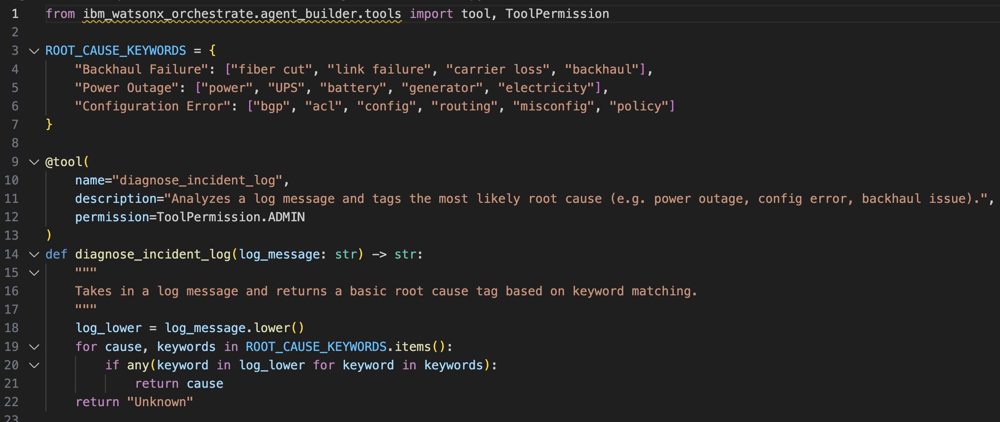
  2. This python function mimics log analysis using keyword matching. 
  3. Notice how the `@tool` decorator. This defines the function as a tool for the watsonx orchestrate extention. Notice how the toll desciption is already defined here.
  4. If you're using a shared environment Add your initials to the tool name
    
  5. Save the file
  6. https://developer.watson-orchestrate.ibm.com/tools/create_tool#creating-python-based-tools

- Import the python tool using the ADK

  1.  Run: `orchestrate tools import -k python -f wxo_assets/tools/diagnose_incident_tool.py`  
  2. Verify: `orchestrate tools list` → you should see `diagnose_incident_log`
  3. https://developer.watson-orchestrate.ibm.com/tools/deploy_tool#importing-a-single-python-tool-file

<!-- > **Console option (SaaS):** From the Orchestrate web console, navigate to **Tools → Add tool → Python**, then upload `wxo_assets/tools/diagnose_incident_tool.py`. -->


#### 2) Import the Incident Diagnosis Agent YAML
This agent definition links the `diagnose_incident_log` tool with the `incident_resolution_guides` knowledge base and enforces a strict output format.

- Review the Agent Yaml
  1. Open the `incident_diagnosis_agent.yaml` in VS Code
      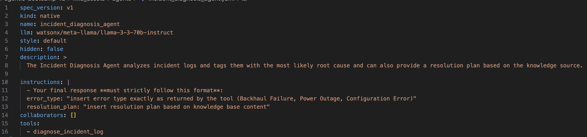
  2. All agents on the backend get defined as yaml. We can create a new agent in the same fashion.
  3. Notice how all the fields match the UI fields. Also Notice we're using a different LLM. 
  4. If you're using a shared environment Add your initials to the agent name
  
  5. https://developer.watson-orchestrate.ibm.com/agents/build_agent

- Import the Agent using the ADK
  1. Run: `orchestrate agents import -f wxo_assets/agents/incident_diagnosis_agent.yaml`  
  2. Verify: `orchestrate agents list` → you should see `incident_diagnosis_agent`
  3. https://developer.watson-orchestrate.ibm.com/agents/import_agent

<!-- > **Console option (SaaS):** Go to **Agents → Add agent**, upload `wxo_assets/agents/incident_diagnosis_agent.yaml`, then save. -->

#### 3) Import the Incident Resolution Knowledge Base
Knowledge Bases refer to Vector Stores that allow your Agents to query unstructured data such as documents. You can use the WXO interal Knowledge Base or connect your own vector store externally. 
- The knowledge base in our case provides mappings from error types to recommended resolution plans. The agent consults it after the tool has identified the root cause.
- Create a Knowledge Base
  1. Navigate to the Agent Builder tab.
              
  2. Find and open the `incident_diagnosis_agent`
      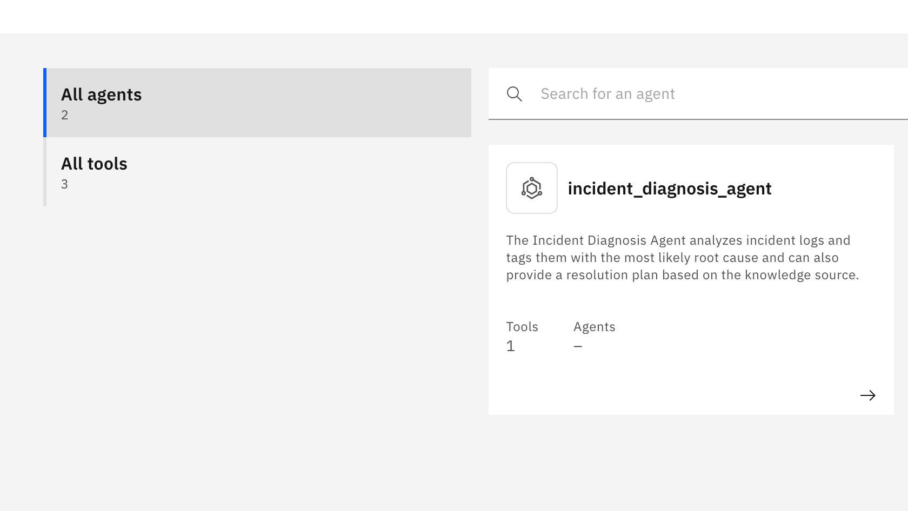
  3. Scroll down to the Knowledge section and click `Choose Knowledge`
      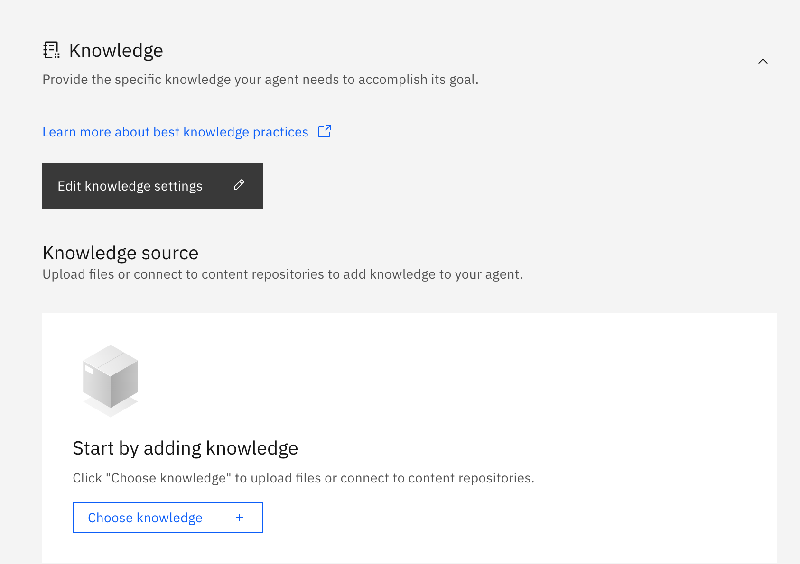
  4. Select Upload Files and upload `/wxo_assets/knowledge_bases/backhaul_failure_guide.pdf`, `/wxo_assets/knowledge_bases/config_error_guide.pdf`, and `/wxo_assets/knowledge_bases/power_outage_guide.pdf`
      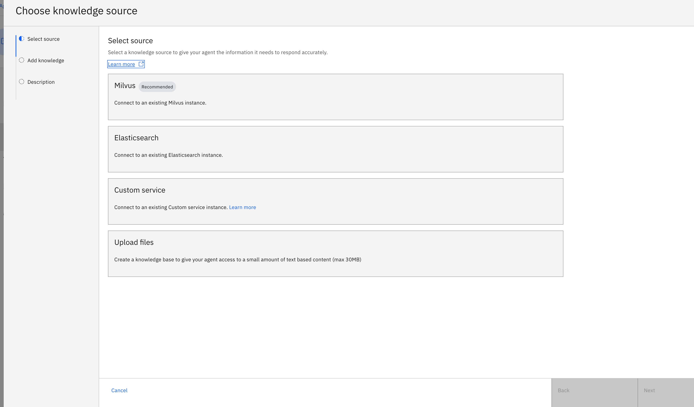
  5. Add the following as a description:
     - `Troubleshooting documentation for resolving common network incident root causes.
  Covers backhaul failures, power outages, and configuration errors.`
  6. Save. This may take 1 min or two.
- Configure the Knowledge Base
  1. Scroll down to the Knowledge section and click `Edit knowledge settings`
      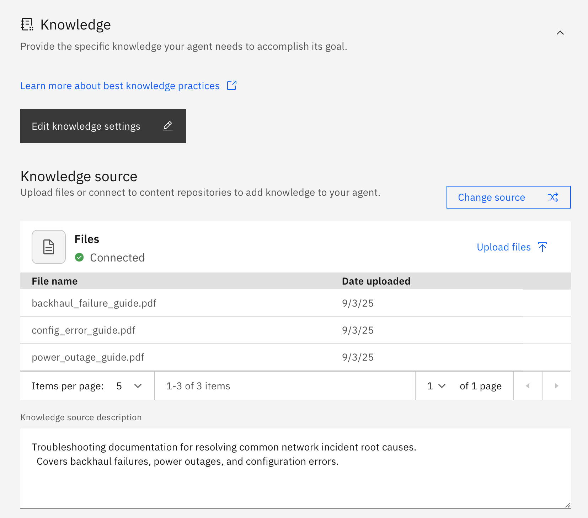
  2. Modify the retreval criteria and save
      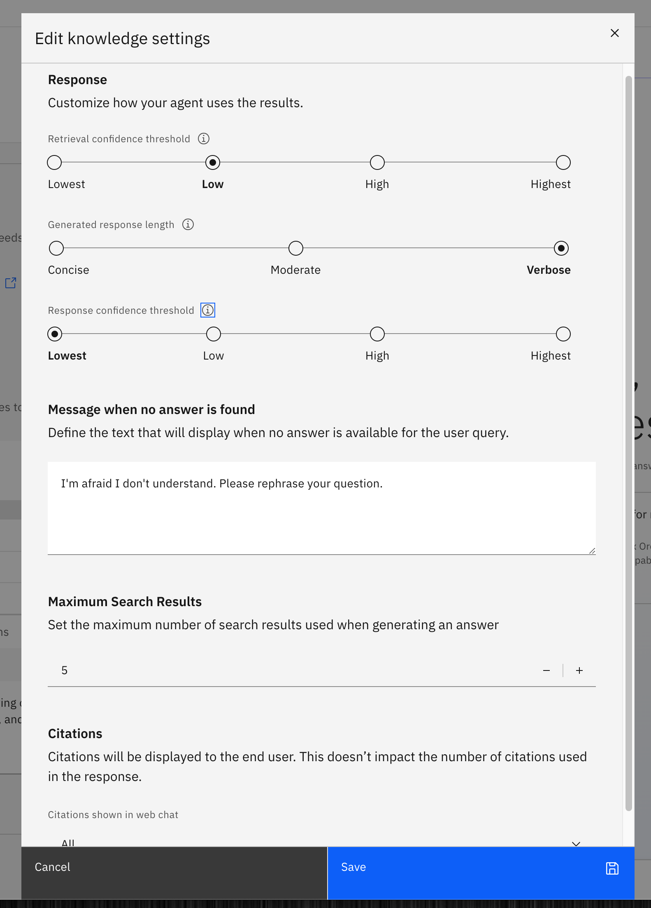

<!--  -->
<!--  -->
<!--  -->
<!--  -->

> **WXO ADK CLI option:** You can import the Knowledge Base from the ADK CLI by running the following commands in your terminal.
>- Run: `orchestrate knowledge-bases import -f wxo_assets/knowledge_bases/incident_resolution_guides.yaml`  
>- Verify: `orchestrate knowledge-bases list` → you should see `incident_resolution_guides`
<!-- 
> **Console option (SaaS):** Go to **Knowledge Bases → Add knowledge base**, then upload `wxo_assets/knowledge_bases/incident_resolution_guides.yaml`. -->

#### 4) Quick sanity checks
- Test your agent with the following prompt: `"UPS unit failed at site S002. Generator did not auto-start. Site running on battery only." what is the error type and resolution plan?`
- The agent should respond with both the **error type** and the **resolution plan**.  


#### 5) Common troubleshooting tips
- **Tool not found:** If missing, re-import `diagnose_incident_tool.py`.  
- **Knowledge base not linked:** Ensure `incident_resolution_guides` is visible in `orchestrate knowledge-bases list`.  
- **Format issues:** The agent always returns `error_type` and `resolution_plan`. If outputs look unstructured, confirm the YAML instructions are unchanged.  


The **Incident Diagnosis Agent** is now ready. It can be invoked directly or through the Supervisor Agent to analyze logs and recommend remediation steps.

---

### The Server Status Agent

The **Server Status Agent** checks whether a given server or URL is reachable.  
This is useful for quickly validating if a service endpoint is online when an incident is reported.

#### 1) Import the Server Status Tool
This tool allows the agent to test HTTP/HTTPS endpoints and return whether they are up or down.

- Run: `orchestrate tools import -k python -f wxo_assets/tools/check_server_status_tool.py`  
- Verify: `orchestrate tools list` → you should see `check_server_status`

> **Console option (SaaS):** From the Orchestrate web console, navigate to **Tools → Add tool → Python**, then upload `wxo_assets/tools/check_server_status_tool.py`.

#### 2) Import the Server Status Agent YAML
This binds the **Server Status Agent** to the `check_server_status` tool you just imported.

- Run: `orchestrate agents import -f wxo_assets/agents/server_status_agent.yaml`  
- Verify: `orchestrate agents list` → you should see `server_status_agent`

> **Console option (SaaS):** Go to **Agents → Add agent**, upload `wxo_assets/agents/server_status_agent.yaml`, then save.

#### 3) Quick sanity checks
- Ask: “Check if dish.com is up.”  
- The agent should call the `check_server_status` tool and return whether the server is reachable.  
- If no response or an error occurs, confirm the tool is present and correctly linked to the agent.

#### 4) Common troubleshooting tips
- **Tool not found:** Re-run `orchestrate tools list`. If `check_server_status` is missing, re-import it.  
- **Incorrect binding:** Verify that the agent YAML references `check_server_status` exactly as the tool name.  
- **Network restrictions:** Ensure the SaaS environment can reach the target server (some internal endpoints may be blocked).  

---

The **Server Status Agent** is now ready. It can be queried directly or invoked by the Supervisor Agent to check server availability in real time.


### The Supervisor Agent

The **Supervisor Agent** acts as the routing brain for this use case. It interprets a user’s request and delegates the task to the correct specialist agent:
- **Network Status Agent** → network/site health questions  
- **Server Status Agent** → server/URL reachability  
- **Incident Diagnosis Agent** → log analysis and remediation recommendations  
- **Communications Agent** → drafting/sending stakeholder updates

This section wires up the Supervisor so it can orchestrate the end-to-end flow from detection → diagnosis → remediation → communication.

#### 0) Prerequisites (verify first)
Make sure these are already imported and visible:
- Tools: `get_data` (OpenAPI), `check_server_status` (Python), `diagnose_incident_log` (Python), and (optionally) `outlook_email` (OpenAPI)
  - Check with: `orchestrate tools list`
- Agents: `network_status_agent`, `server_status_agent`, `incident_diagnosis_agent`, `communications_agent`
  - Check with: `orchestrate agents list`

If anything is missing, complete those agent/tool steps first.

#### 1) Import the Supervisor Agent YAML
This registers the **Supervisor Agent** and declares its collaborators (the four specialist agents).

- Open the `supervisor_agent.yaml` and modify the collaborator agent names to the correct names of your agents.
- Run: `orchestrate agents import -f wxo_assets/agents/supervisor_agent.yaml`  
- Verify: `orchestrate agents list` → you should see `supervisor_agent`

> **Console option (SaaS):** Go to **Agents → Add agent**, upload `wxo_assets/agents/supervisor_agent.yaml`, then save.

#### 2) 2. Add Collaborator Agents to the NOC_Supervisor_Agent
a. Go to Manage Agents - > Click on NOC_Supervisor_Agent
b. Click on Tools -> Add Agent as shown in screenshot
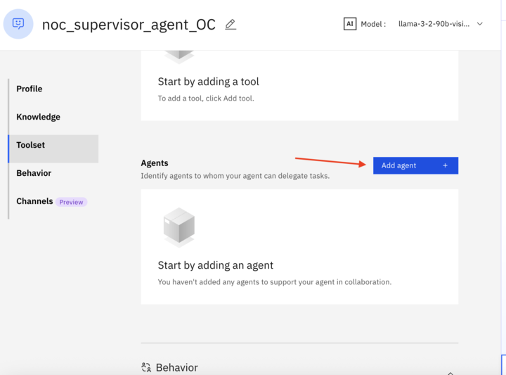
c. Choose "Add from Local Instance" option
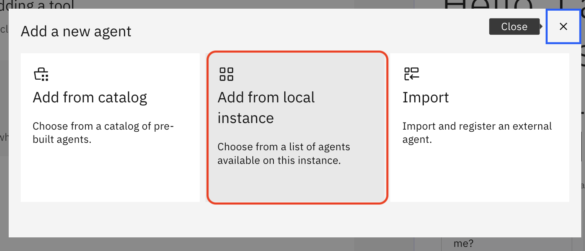
d. Click on 4 Agents you created as shown below:
network_status_agent
server_status_agent
incident_diagnosis_agent
communications_agent
e. Click on Add Agent
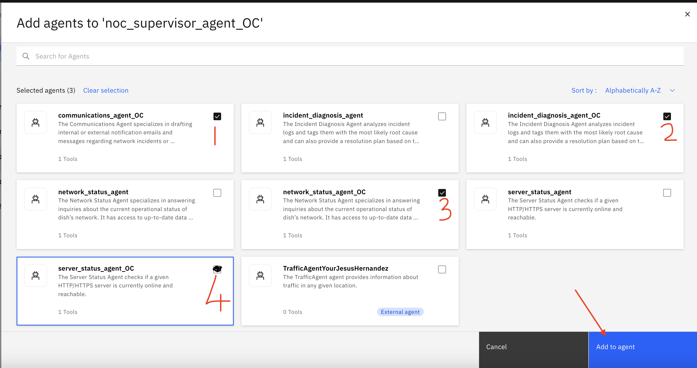

#### 3) Quick sanity checks (routing behavior)
Try these natural-language prompts to validate routing:
- “**What’s the status of site S002?**” → should route to **Network Status Agent** (calls `get_data`)
- “**Check if dish.com is up.**” → should route to **Server Status Agent** (calls `check_server_status`)
- “**Here’s an incident log… what’s the root cause and fix?**” → should route to **Incident Diagnosis Agent** (uses `diagnose_incident_log`, consults resolution guides if configured)
- “**Draft an email to the LA network team that the incident is resolved.**” → should route to **Communications Agent** (and can send via Outlook if configured)

#### 4) Common troubleshooting tips
- **Agent not found:** Re-run `orchestrate agents list`. If `supervisor_agent` is missing, re-import `wxo_assets/agents/supervisor_agent.yaml`.
- **Wrong route chosen:** Check the Supervisor’s instruction/routing rules. Ensure keywords in your test prompts align with the rules (e.g., “status/site/node/incident” → network status).
- **Tool call fails downstream:** Confirm the target specialist agent is correctly bound to its tool (e.g., `get_data`, `check_server_status`, `diagnose_incident_log`) and that the tool exists in `orchestrate tools list`.
- **Name mismatches:** The collaborator names in the Supervisor must match the registered agent names exactly.


#### 5) Bonus Challenge: Override the Default Greeting
By default, new agents start with “Hello! I am watsonx Orchestrate, an AI assistant, created by IBM. How can I help you today?”. You can override this in the Orchestrate Console. 

1. Go to the Orchestrate Console.
2. In the left-hand navigation (hamburger menu), go to Build → Agent Builder.
3. Click on `supervisor_agent` to view its details.
4. Edit the Agent Behavior in a way it says "Hello, I’m the Supervisor. I can help you check network and server status, diagnose incidents, or draft communications. How can I help you today?"
> Here are some things you may want to try: 
  > - Role clarity: Specify to the agent that it should clearly identify itself as the Supervisor.
  > - Task framing: Tell the agent to summarize the types of requests it can handle (network checks, incident diagnosis, communications).
  > - Override default: Make sure to instruct the agent to fully replace the standard watsonx greeting with this custom introduction.
  > - Constraints: Specify that the agent should not mention IBM or watsonx.
  > - Tone & personality: You can guide the agent to adopt a professional, supportive, concise, or friendly tone to make the greeting more engaging.

✅ The next time you start a chat, the agent should greet with your customized introduction instead of the default watsonx Orchestrate greeting.


The **Supervisor Agent** is now ready. It provides a single conversational entry point and automatically delegates tasks to the right agent, enabling an end-to-end incident flow.


---

## Summary

In this lab, we explored the use case of a Supervisor managing network incidents with the help of an agentic AI solution. We began by creating specialized agents for network status checks, server availability, incident diagnosis, and stakeholder communications. Each agent was connected to the right tools and data sources — for example, the Network Status Agent used an OpenAPI tool to fetch live site data, while the Communications Agent leveraged Outlook integration to send updates.  

Finally, we brought everything together through the **Supervisor Agent**, which serves as the main conversational entry point. From this single interface, the Supervisor can ask natural language questions and the system will automatically route the request to the appropriate agent.  

This exercise provides a reference implementation to help you understand how multiple specialized agents can be orchestrated in **watsonx Orchestrate (SaaS)**. Some aspects are simulated, and in a production environment you would extend the integrations with real systems of record, monitoring platforms, and communication services. A truly agentic solution would go further by adding reasoning and planning capabilities, allowing the system to autonomously investigate, resolve, and communicate about incidents end-to-end.  

Our goal here is to give you a starting point and spark ideas about how to apply agentic AI in real operational contexts. With these foundations, you can begin experimenting with automating parts of your own workflows and consider where autonomous AI decision-making could add the most value.  
